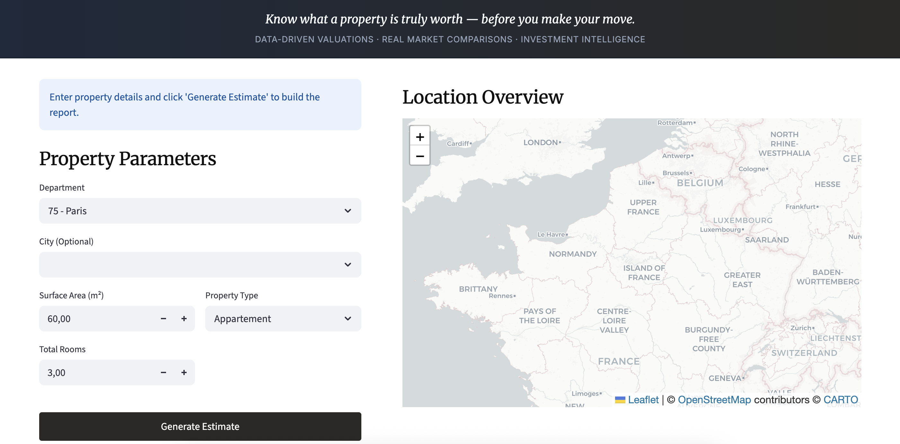
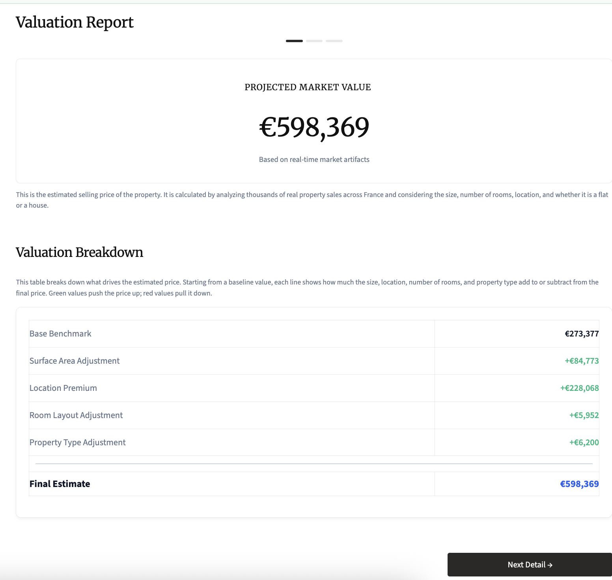
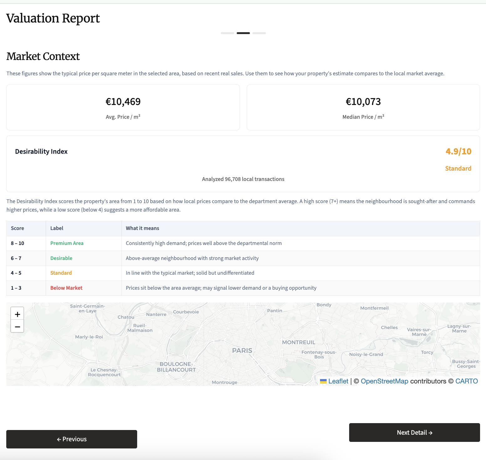
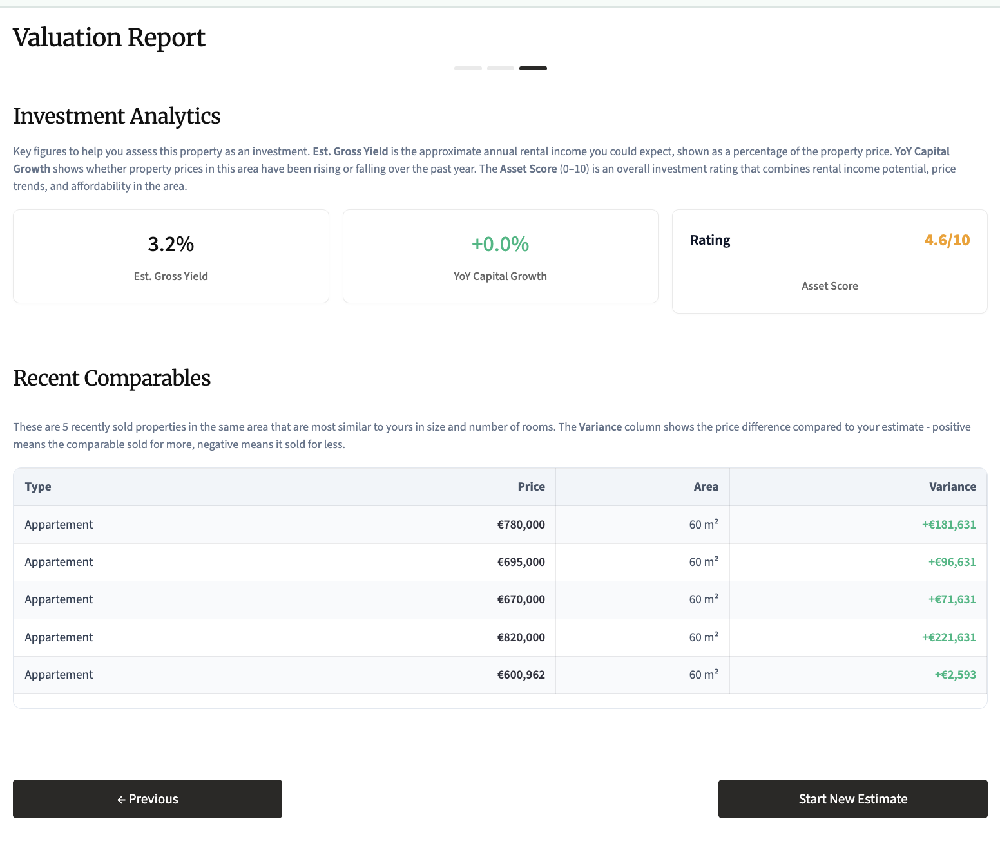

# ImmoPrice API — French Property Valuation & Market Intelligence



> **Goal**: Estimates property values, benchmark against the market, and assess investment potential.

ImmoPrice is a production-ready REST API and UI to help you evaluate the opportunities and price of real estate. It combines an XGBoost predictive model with real-market statistics derived from the DVF (Demandes de Valeurs Foncières) open dataset to deliver actionable insights.
---

## Why ImmoPrice?

Pricing a property accurately is one of the most complex tasks in real estate. Overpricing leads to stagnant listings; underpricing leaves money on the table. ImmoPrice addresses this by:

- **Providing an objective, data-driven estimated value** rather than relying on gut feeling or manual comparisons.
- **Explaining *why* a property is estimated at a given price**, breaking down each factor's monetary contribution.
- **Contextualising the estimate against real market data** — average prices, comparable sales, and historical growth trends.
- **Delivering an investment score** that synthesises rental income potential, market momentum, and relative affordability into a single actionable number.

---

## Price estimate




The main driver of our solution is the ML model developed using **XGBoost**. With this model, we are able to predict the price of a property based on a list of features. The model is trained on the DVF dataset, which contains real estate transaction data from France.

The main features used in the model are:

| Field | Type | Description |
|---|---|---|
| `surface_reelle_bati` | `float` | Built surface area in m² |
| `nombre_pieces_principales` | `float` | Number of main rooms |
| `code_departement` | `string` | French department code (`"13"`, `"31"`, `"59"`, `"69"`, `"75"`) |
| `type_local` | `string` | Property type: `"Appartement"` or `"Maison"` |

Each time the model runs, it not only calculates the expected price, but also provides a **comprehensive breakdown** of the most important features so the user can understand what is driving the price.


**How the estimate is calculated:**

The model is an XGBoost regressor wrapped in a scikit-learn `Pipeline`. Input features are preprocessed before being fed to the model:

- **Numeric features** (`surface_reelle_bati`, `nombre_pieces_principales`) are standardised with `StandardScaler`.
- **Categorical features** (`code_departement`, `type_local`) are one-hot encoded with `OneHotEncoder`.
- **Engineered features** are derived automatically:
  - `surface_per_room` — average room size, capturing density/quality signals.
  - `log_surface` — log-transformation of surface area, which compresses the wide distribution of property sizes and improves model accuracy.

The model was trained on tens of thousands of real property transactions from five French departments.

**How the breakdown is calculated:**

The breakdown uses XGBoost's built-in **prediction contributions** (`pred_contribs`). For each input, the model decomposes the prediction into the sum of contributions from each feature. The breakdown returned by the API groups these into five intuitive components:

| Key | What it represents |
|---|---|
| `base_value` | The model's global average prediction — the starting point before any property-specific adjustments |
| `surface` | The EUR added (or removed) because of the property's built surface area |
| `location` | The EUR premium or discount driven by the department |
| `rooms` | The EUR adjustment attributed to the number of rooms |
| `property_type` | The EUR delta between an apartment and a house in that market |

> **Business use:** The breakdown turns a black-box prediction into a transparent, auditable estimate. It can be used to justify a valuation to a client, identify which factors are inflating or deflating a price, or compare two properties on equal footing.

## Market comparison



Besides the ML model, we also provide a list of the most similar properties in the same department. This allows you to compare the estimated price with the price of similar properties in the same department.

**How comparables are selected:**

The algorithm computes a normalised Euclidean distance between the query property and every transaction in the department, using surface and rooms as dimensions:

```
distance = ((surface_query - surface_i) / surface_query)² + ((rooms_query - rooms_i) / rooms_query)²
```

The `N` transactions with the smallest distance are returned. If enough transactions of the same property type exist, the search is restricted to matching types to ensure relevance.

> **Business use:** Comparables are the industry standard for validating a property estimate. Presenting actual sold prices of similar properties alongside the model's prediction dramatically increases buyer/seller trust and provides a concrete market sanity check.

### Market Context & Desirability Index

Understanding a property's estimated price is only half the picture — you also need to know how that price sits relative to the broader market in the same area. ImmoPrice surfaces this context automatically so buyers, sellers, and advisors can benchmark any estimate without additional research.

#### Average & Median Price per m²

For every department, we compute two price-per-square-metre benchmarks directly from the DVF transaction data:

| Metric | What it tells you |
|---|---|
| **Average price / m²** | The mean €/m² across all valid transactions in the department. Useful as a broad market reference. |
| **Median price / m²** | The midpoint €/m², less sensitive to extreme luxury or distressed sales. A more robust indicator of what a typical buyer pays. |

These figures are computed at API startup from the cleaned transaction dataset and reflect the full population of recorded sales — not a sample or survey estimate.

> **Business use:** Placing the estimated price/m² of a specific property next to the departmental average and median gives buyers an immediate sense of whether they are looking at a market-rate deal, a premium property, or a potential bargain.

#### Desirability Index

The Desirability Index is a **location quality score from 1 to 10** that measures how the property's implied price per m² compares to the department-wide average for a property of the same size. It answers the question: *"Is this a sought-after area, or a more affordable one?"*

**How it is calculated:**

1. The implied price per m² of the estimate is computed as `prediction / surface`.
2. This is divided by the department's average price per m² to produce a `ratio`.
3. The ratio is mapped onto a 1–10 scale centred on 5 (market average):

```
raw_score = 5 + (ratio - 1) × 3
desirability_index = clamp(raw_score, 1, 10)
```

A ratio of 1.0 (exactly average) yields a score of **5**. A ratio above 1.0 (above-average price area) pushes the score higher; below 1.0 pulls it lower.

**How scores map to labels:**

| Score | Label | Interpretation |
|---|---|---|
| 8 – 10 | **Premium Area** | Consistently high demand; prices well above the departmental norm |
| 6 – 7 | **Desirable** | Above-average neighbourhood with strong market activity |
| 4 – 5 | **Standard** | In line with the typical market; solid but undifferentiated |
| 1 – 3 | **Below Market** | Prices sit below the area average; may indicate lower demand or an affordability opportunity |

> **Business use:** The Desirability Index gives a buyer or agent an at-a-glance signal of neighbourhood quality without requiring local knowledge. It can be used to justify a premium asking price in a high-scoring area, or to flag to a buyer that they are entering a lower-demand zone and should price-negotiate accordingly.

## Investment oppotunities



Our framework also has capabilities to evaluate the investment attractiveness and potential of the property.

Given a property's estimated price and surface area, we calculate a suite of investment metrics designed to help a buyer assess the financial attractiveness of a purchase.

#### Rental Yield (`rental_yield`)
The **gross annual rental yield** is expressed as a percentage of the property value. It is calibrated per department based on typical market rates:

| Department | City | Yield |
|---|---|---|
| `75` | Paris | 3.2% |
| `69` | Lyon | 4.1% |
| `31` | Toulouse | 4.6% |
| `13` | Marseille | 5.3% |
| `59` | Lille | 5.8% |

> Higher yields in cities like Lille and Marseille reflect a lower purchase price relative to achievable rents. Paris's lower yield reflects its elevated property prices despite strong rental demand.

#### Monthly Rent (`monthly_rent`)
Estimated monthly income from renting the property, derived from the annual yield:

```
monthly_rent = (predicted_price × rental_yield%) / 12
```

> **Business use:** Gives an investor an immediate sense of expected cash flow from the property.

#### Market Growth (`market_growth`)

We also provide the **year-over-year percentage change in median price per m²**, computed directly from the raw DVF transaction data. The calculation compares the median €/m² of the two most recent complete years in the dataset:

```
market_growth (%) = (median_ppm2_last_year - median_ppm2_prior_year) / median_ppm2_prior_year × 100
```

> A positive value indicates a rising market; a negative value indicates a correction. This is a data-driven, objective signal rather than a survey-based estimate.

#### Investment Score (`investment_score`)
A **composite score from 0 to 10** that synthesises the three most important investment dimensions into a single number. The score is a weighted average of three sub-scores:

| Component | Weight | Logic |
|---|---|---|
| **Yield score** (40%) | Higher yield → higher score. Calibrated so 1% yield = 0 and 8% yield = 10. | `min(10, (rental_yield - 1) / 0.7)` |
| **Growth score** (40%) | Positive market growth → higher score. Calibrated so -5% growth = 0 and +10% growth = 10. | `min(10, (market_growth + 5) / 1.5)` |
| **Affordability score** (20%) | Properties priced below the department average score higher. A ratio of 0.5× average = maximum score; at 2× average = 0. | `min(10, (2 - pred_pm2 / dept_avg_pm2) × 10)` |

```
investment_score = yield_score × 0.4 + growth_score × 0.4 + affordability_score × 0.2
```

> **Business use:** The investment score condenses complex multi-factor analysis into a single, easily communicated metric. It allows a buyer or advisor to quickly rank multiple properties or markets and focus attention where the opportunity is greatest.

---

## Data Sources

All statistics are derived from **DVF (Demandes de Valeurs Foncières)**, the official French government dataset of property transactions, available at [app.dvf.etalab.gouv.fr](https://app.dvf.etalab.gouv.fr/).

The API currently covers five departments:

| Code | Department | Main City |
|---|---|---|
| `13` | Bouches-du-Rhône | Marseille |
| `31` | Haute-Garonne | Toulouse |
| `59` | Nord | Lille |
| `69` | Rhône | Lyon |
| `75` | Paris | Paris |

Because statistics (averages, growth rates, comparables) are computed directly from this dataset, they reflect actual market activity rather than estimated or modelled values.

---

## How to Run

### Prerequisites

- Python 3.9+
- pip

### 1. Install Dependencies

```bash
pip install -r requirements.txt
```

### 2. Prepare the Data

```bash
python -m src.model.data_cleaning
```

Merges the raw regional CSVs into `data/cleaned_dataset.csv`.

### 3. Train the Model

```bash
python -m src.model.train
```

Trains the XGBoost pipeline and saves versioned artifacts to `models/`:
- `model_<version>.joblib` — the full sklearn pipeline
- `contract_<version>.json` — feature schema, version tag, and evaluation metrics

### 4. Option A: Run Locally

**Start the API** (from `src/`):
```bash
cd src
uvicorn api.main:app --host 0.0.0.0 --port 8000
```

**Start the UI** (in a separate terminal, from `src/`):
```bash
cd src
streamlit run ui/app.py --server.headless true --server.port 8501
```

Open [http://localhost:8501](http://localhost:8501) in your browser.

### 5. Option B: Run with Docker

```bash
docker-compose up --build
```

Starts both services:
- **Streamlit UI**: [http://localhost:8501](http://localhost:8501)
- **FastAPI (interactive docs)**: [http://localhost:8000/docs](http://localhost:8000/docs)

### 6. Run Tests

```bash
pytest tests/
```

---

## Model Performance

| Metric | Description |
|---|---|
| **MAE** | Mean Absolute Error — average EUR difference between predicted and actual price |
| **RMSE** | Root Mean Square Error — penalises large errors more than MAE |
| **MedAE** | Median Absolute Error — robust measure unaffected by outlier transactions |
| **MAPE** | Mean Absolute Percentage Error — relative accuracy across different price ranges |
| **R²** | Coefficient of determination — proportion of price variance explained by the model |

Evaluation metrics for the latest trained model are stored in `models/contract_<version>.json`.

---

## Repository Layout

```
├── data/                          # Raw & cleaned CSV datasets
│   ├── paris_dataset.csv
│   ├── rhone_dataset.csv
│   ├── nord_dataset.csv
│   ├── haute_garonne_dataset.csv
│   ├── bouches_du_rhone_dataset.csv
│   └── cleaned_dataset.csv
├── models/                        # Versioned model (.joblib) & contract (.json)
├── src/
│   ├── api/
│   │   ├── main.py                # FastAPI app entry point
│   │   ├── routes.py              # All API endpoint definitions
│   │   ├── schemas.py             # Pydantic request/response schemas
│   │   ├── services.py            # Data loading & pre-computation at startup
│   │   └── constants.py           # Department metadata & configuration
│   ├── model/
│   │   ├── data_cleaning.py       # Merge & clean raw DVF CSVs
│   │   ├── train.py               # Train XGBoost pipeline, export artifacts
│   │   └── score.py               # Evaluation metrics (MAE, RMSE, R², etc.)
│   ├── scoring/
│   │   └── predict.py             # Scoring function with price breakdown
│   └── ui/
│       └── app.py                 # Streamlit dashboard
├── tests/
│   ├── test_api.py                # API endpoint tests
│   ├── test_data_cleaning_eda.py  # Data cleaning & EDA tests
│   └── test_model.py              # Model training & prediction tests
├── Dockerfile.api                 # Docker image for FastAPI
├── Dockerfile.ui                  # Docker image for Streamlit
├── docker-compose.yml             # Compose config for both services
├── conftest.py                    # Shared pytest fixtures
└── requirements.txt               # Python dependencies
```